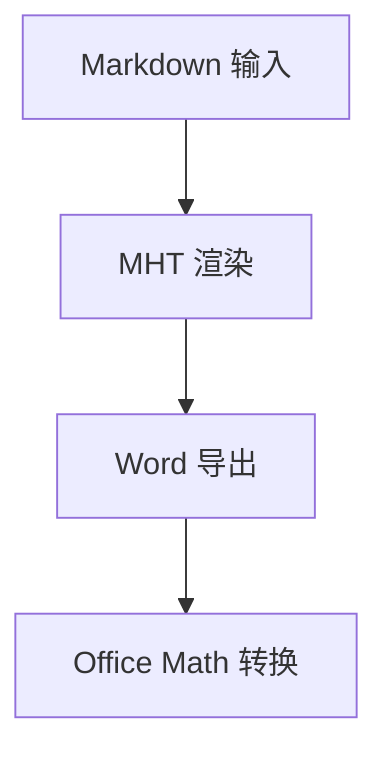

# md-to-word 回归测试文档

标题: md-to-word 回归测试文档
文档类型: 功能回归
版本: v1.0
作者: repo2patent
日期: 2026-04-08
备注: 用于验证标题、段落、列表、表格、公式、代码、Mermaid、图片等能力在修复表格后没有退化

---

## 一、测试目标

本文档用于验证 `md-to-word` 在以下场景中的稳定性：

- 正文标题层级与自动编号
- 普通段落与行内公式 `$E = mc^2$`
- 无序列表、有序列表与嵌套列表
- Markdown 表格，包括左对齐、居中、右对齐
- 块公式，包括分式、矩阵和分段函数
- 普通代码块与 Mermaid 代码块
- 本地图片插入

## 1.1 基础段落

这是一段普通正文，用于测试段落渲染、中文标点、英文混排和行内公式。系统应当保留 `inline code`，同时保证公式 `$a^2 + b^2 = c^2$` 在后续 Word 流水线中可继续处理。

第二段用于测试连续自然段。这里故意加入较长文本，确认换行、缩进和默认正文样式没有因为表格支持而被污染。若这段导出后出现表格样式串入正文，说明实现仍有副作用。

## 1.2 列表能力

- 一级无序项 A
  - 二级无序项 A.1
  - 二级无序项 A.2，附带 `inline code`
- 一级无序项 B

1. 一级有序项 1
   1. 二级有序项 1.1
   2. 二级有序项 1.2
2. 一级有序项 2

## 1.3 表格能力

### 1.3.1 简单二维表

| 检查项 | 结果 |
|------|------|
| 标题 | 应正确显示为标题样式 |
| 普通段落 | 应保持正文样式 |
| 表格 | 应输出为真正的 Word 表格 |

### 1.3.2 对齐表

| 字段 | 对齐方式 | 示例值 |
| :--- | :---: | ---: |
| 左列 | 居中列 | 100 |
| 缓存命中率 | 居中展示 | 99.95 |
| 错误数 | 本月汇总 | 0 |

## 1.4 代码块

```python
def health_check(service: str) -> dict[str, str]:
    return {
        "service": service,
        "status": "ok",
    }
```

```json
{
  "service": "gateway",
  "status": "ok",
  "checked_at": "2026-04-08T15:00:00+08:00"
}
```

## 1.5 块公式

$$
\frac{\alpha + \beta}{2}
$$

$$
\begin{bmatrix}
1 & 2 \\
3 & 4
\end{bmatrix}
$$

$$
\begin{cases}
x + y, & x > 0 \\
x - y, & x \leq 0
\end{cases}
$$

## 1.6 Mermaid



## 1.7 图片


## 1.8 结论段

如果该文档最终导出为 Word 后满足以下条件，说明当前修复没有明显副作用：

1. 标题层级正常，未丢失编号或样式。
2. 表格显示为真实表格，而不是带 `|` 的文本行。
3. 列表缩进正常，代码块保持等宽风格。
4. 块公式仍能进入 Word 公式处理链。
5. Mermaid 和本地图片仍能插入到文档中。
