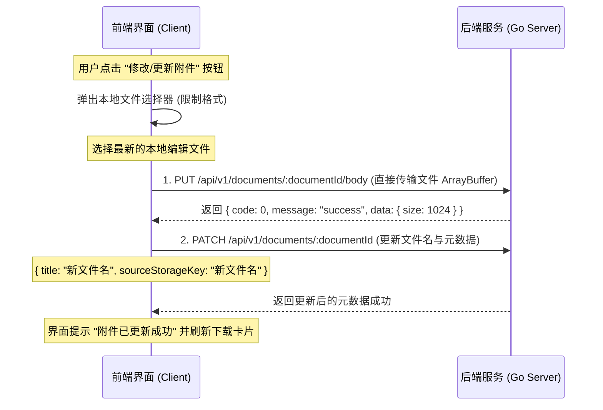

# 科研项目文档管理系统前端技术规约说明书 (Frontend TRD)

## 1. 技术选型与工程化配置

系统前端基于现代单页应用 (SPA) 架构开发，全面采用主流的前端工程化技术栈：

- **核心框架**：React 19 + TypeScript (强类型支持，提高组件开发安全性与代码可读性)。
- **构建工具**：Vite 7.0+ (极速的热更新及打包构建体验)。
- **UI 组件库**：Ant Design 6.x (规范表单交互、树状节点呈现、按钮、消息通知 `App.useApp()` 的全局集成)。
- **富文本协同技术**：
  - `@tiptap/react` 及其基础套件 (基于 ProseMirror 的无头富文本框架，易于定制样式和控制节点)。
  - `yjs` 核心库 (CRDT 底层对象支持)。
  - `@tiptap/extension-collaboration` (协同绑定桥接插件)。
- **包管理工具**：优先使用 `pnpm` 进行高速、轻量的依赖管理（退选支持 `npm`）。

---

## 2. 前端目录结构与路由架构

前端工程核心源码位于 `Frontend/src/` 目录下，按照高内聚、低耦合原则按功能分拆：

```
Frontend/src/
├── main.tsx                # 应用启动挂载入口
├── app.tsx                 # 引入路由树与全局 AntD Context / App 包裹器
├── router/                 # 路由定义 (基于 react-router-dom)
│   └── index.tsx           # 路由列表与懒加载页面组件注册
├── contexts/               # 全局状态控制中心
│   └── AuthContext.tsx     # 包含用户注册、登录态、个人信息、JWT 维护
├── services/               # 后端 API 服务抽象 (RESTful)
│   ├── api.ts              # Axios 实例封装（通用拦截器，注入 Bearer Token）
│   ├── auth.ts             # 登录、注册、修改密码 API 映射
│   ├── document.ts         # 文档元数据、二进制正文及 ACL 相关的 API
│   └── types.ts            # 通用 TypeScript 类型与常量（如权限位图常量）
├── hooks/                  # 复用逻辑钩子
├── components/             # 通用组件封装
├── pages/                  # 视图页面级组件
│   ├── Login/              # 登录页面
│   ├── WorkspaceList/      # 工作区/项目总览列表
│   ├── WorkspaceDetail/    # 单个项目的左侧文档树 + 右侧文件夹详情
│   ├── DocumentEditor/     # 协同编辑页面核心
│   └── AdminUsers/         # 管理员后台人员维护页
└── theme/                  # AntD 自定义视觉主题配置
```

---

## 3. 协同编辑模块设计 (Tiptap + Yjs)

系统最核心的功能组件是富文本编辑器。以下是其初始化与协作逻辑：

### 3.1 本地 YDoc 与 Tiptap 绑定
在 `useDocumentEditor.ts` 钩子中，编辑器通过 Collaboration 插件绑定本地 `Y.Doc` 对象：
```typescript
import { useEditor } from '@tiptap/react'
import StarterKit from '@tiptap/starter-kit'
import Collaboration from '@tiptap/extension-collaboration'
import * as Y from 'yjs'

const ydoc = useMemo(() => new Y.Doc(), [documentId])

const editor = useEditor({
  extensions: [
    StarterKit.configure({ undoRedo: false }), // 协同场景下禁用默认撤销/重做，由 Yjs 统一接管
    Collaboration.configure({
      document: ydoc,
    }),
  ],
  editorProps: {
    attributes: {
      class: 'tiptap-editor-content', // 绑定公共样式类以控制富文本排版
    },
  },
}, [ydoc])
```

### 3.2 现有数据流（HTTP 单向模式）
1. **加载期**：调用 `documentService.getBody(documentId)` 获取后端的二进制 state 包，然后利用 `Y.applyUpdate(ydoc, new Uint8Array(bodyRes))` 还原文字排版。
2. **保存期**：用户点击“保存”按钮，通过 `Y.encodeStateAsUpdate(ydoc)` 拿到本地的二进制快照，打包通过 `documentService.putBody` 传给 Go 后端。

---

## 4. 全局状态与高复用业务 Hooks

- **`AuthContext`**：
  - 管理登录状态及本地存储的 Token。
  - 通过 Axios 请求拦截器机制自动在每个 API 请求中携带 JWT Bearer Token。
- **`useDocumentEditor`**：
  - 整合文档加载、元数据更新、删除、移动和归档逻辑。
  - 维护 `saving`, `updating`, `lastSaved`, `error` 等界面交互状态。
- **`useDocumentACL`**：
  - 封装特定文档权限控制逻辑，暴露 `items` (已有规则列表)、`createACL`、`updateACL`、`removeACL` 核心函数。

---

## 5. 前端优化与已知缺失演进路线

为彻底盘活协同服务，前端在未来迭代中必须重点重构以下两个部分：

### 5.1 补全 `y-websocket` 整合，开启实时协同
- **第一步：加入依赖**：在 `Frontend/package.json` 中声明 `"y-websocket": "^2.0.0"` 并进行安装。
- **第二步：整合 WebSocket 通信**：
  在 `useDocumentEditor.ts` 中引入 `WebsocketProvider`。挂载时不仅从 Go 后端拉取初始数据（用于兜底网络延迟），而且建立与 Node 协同服务的 WebSocket 链路：
  ```typescript
  import { WebsocketProvider } from 'y-websocket'
  
  useEffect(() => {
    if (!documentId) return
    
    // 建立通信桥梁
    const provider = new WebsocketProvider(
      'ws://localhost:3001',
      `documents/${documentId}`,
      ydoc
    )
    
    return () => {
      provider.destroy()
    }
  }, [documentId, ydoc])
  ```
- **第三步：协同光标与感知 (Awareness)**：
  集成 `@tiptap/extension-collaboration-cursor`，并从 `provider.awareness` 中同步其他协作者在文档中的动态光标位置与显示名称，于编辑器顶部展示当前在线人数。

### 5.2 共享授权弹窗 (ACLModal) 的用户搜索功能（已实现）
- **实现方案**：在 `ACLModal.tsx` 中，引入动态搜索下拉组件，摆脱了以前用户必须手动复制粘贴 36 位 UUID 的痛点。
- **具体实现细节**：
  - **接口对接**：在 `Frontend/src/services/user.ts` 中封装了 `userService.search(q)`，请求 `GET /api/v1/users/search?q=xxx` 接口。
  - **组件整合**：将 `ACLModal.tsx` 中的普通文本框替换为了 Ant Design 的 `<Select showSearch>` 组件。
  - **搜索回调**：通过 `onSearch={handleUserSearch}`，触发模糊搜索，获取匹配的用户列表并更新 `searchedUsers` 状态。
  - **选项展示**：将检索到的用户数据转化为 `{ value: u.id, label: `${u.displayName} (${u.email})` }` 的格式，以供用户直观选择。
  - **编辑回显处理**：在编辑模式下，若当前授权的 `subjectId` 不在搜索列表中，程序会自动补接一个 `用户 ID: ${editing.subjectId}` 的 Fallback 选项，避免渲染为空，极大提升了用户体验与健壮性。

### 5.3 附件型文档 (File Attachments) 的更新与覆盖保存指引（前端开发特供）
为了让前端开发人员能以最简洁、低门槛的方式接入附件修改并保存功能，以下提供了标准的业务步骤、核心接口及参考代码。

#### 5.3.1 核心对接流程
对于常规附件（如 Excel、Word、PDF），因为无法直接在网页中打字，编辑与更新需要遵循“下载原件 -> 本地用专业软件编辑 -> 重新上传并保存覆盖”的流程：



#### 5.3.2 前端对接代码实例

##### 1. 前端 API 封装 (`src/services/document.ts`)
我们已经在 `documentService` 中为您封装好了上传二进制的方法 `putBody`，如果您是更新文件，只需要这样调用：
```typescript
import { documentService } from './document'

// 1. 保存/替换文件二进制正文
// data 可以是 input type="file" 拿到的 File 对象转成 ArrayBuffer 或 Uint8Array
// ext 对应文件扩展名，例如: 'word', 'pdf' 等 (不可传 'yjs_state')
async function uploadNewFileContent(documentId: string, fileData: ArrayBuffer, ext: string) {
  return documentService.putBody(documentId, new Uint8Array(fileData), {
    'X-Body-Type': ext 
  })
}

// 2. 同步更新文档的文件名元数据 (可选，若文件名发生变更)
async function updateFileMeta(documentId: string, newFilename: string) {
  return documentService.update(documentId, {
    title: newFilename,
    sourceStorageKey: newFilename
  })
}
```

##### 2. 界面层接入建议 (`src/pages/DocumentEditor/index.tsx`)
您可以在 `DocumentEditorPage` 附件结果页面 (`styles.fileShell`) 的 `extra` 动作区域，并列增设一个 `<Upload>` 按钮：
```tsx
import { Upload, Button, message } from 'antd'

// 在页面组件内声明更新逻辑
const handleUploadNewVersion = async (file: File) => {
  try {
    message.loading({ content: '正在上传新版本...', key: 'uploading', duration: 0 })
    
    // 读取文件为 ArrayBuffer
    const arrayBuffer = await file.arrayBuffer()
    
    // 获取后缀名 (去掉 .)
    const ext = file.name.split('.').pop() || ''
    
    // 步骤 A: 上传并替换后端二进制正文
    await documentService.putBody(document.id, new Uint8Array(arrayBuffer), { 'X-Body-Type': ext }) 
    
    // 步骤 B: 修正文件名元数据
    await documentService.update(document.id, {
      title: file.name,
      sourceStorageKey: file.name
    })
    
    message.success({ content: '附件新版本已成功覆盖并保存！', key: 'uploading' })
    
    // 刷新页面状态以获取最新文件详情
    fetchDocument() 
  } catch (err) {
    message.error({ content: '覆盖保存失败，请重试', key: 'uploading' })
  }
}

// 界面呈现
<Upload beforeUpload={(file) => { handleUploadNewVersion(file); return false; }} showUploadList={false}>
  <Button size="large">上传本地最新版覆盖</Button>
</Upload>
```

只要按此结构拼装请求，就可以极其安全、完美地通过 `PUT` 和 `PATCH` 接口完成附件更新与替换保存工作。傻瓜式调用，请勿漏写 `X-Body-Type` 标头以防止后端类型校验报错。
