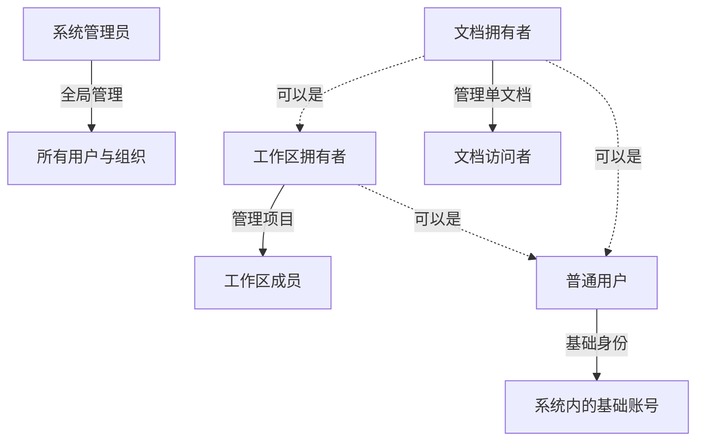
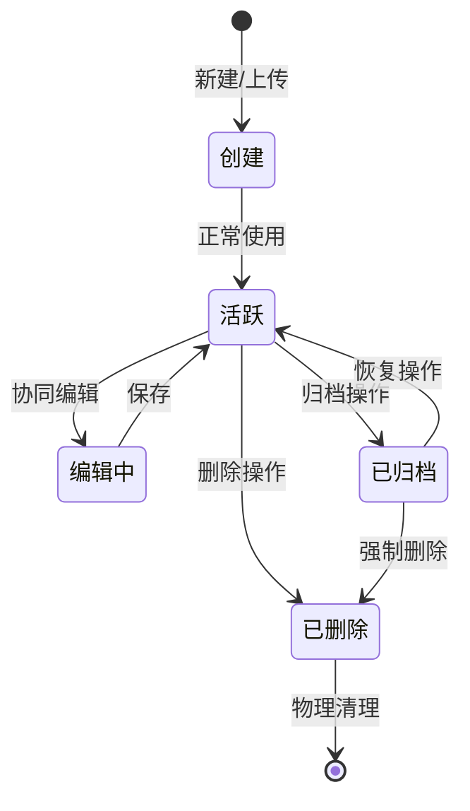
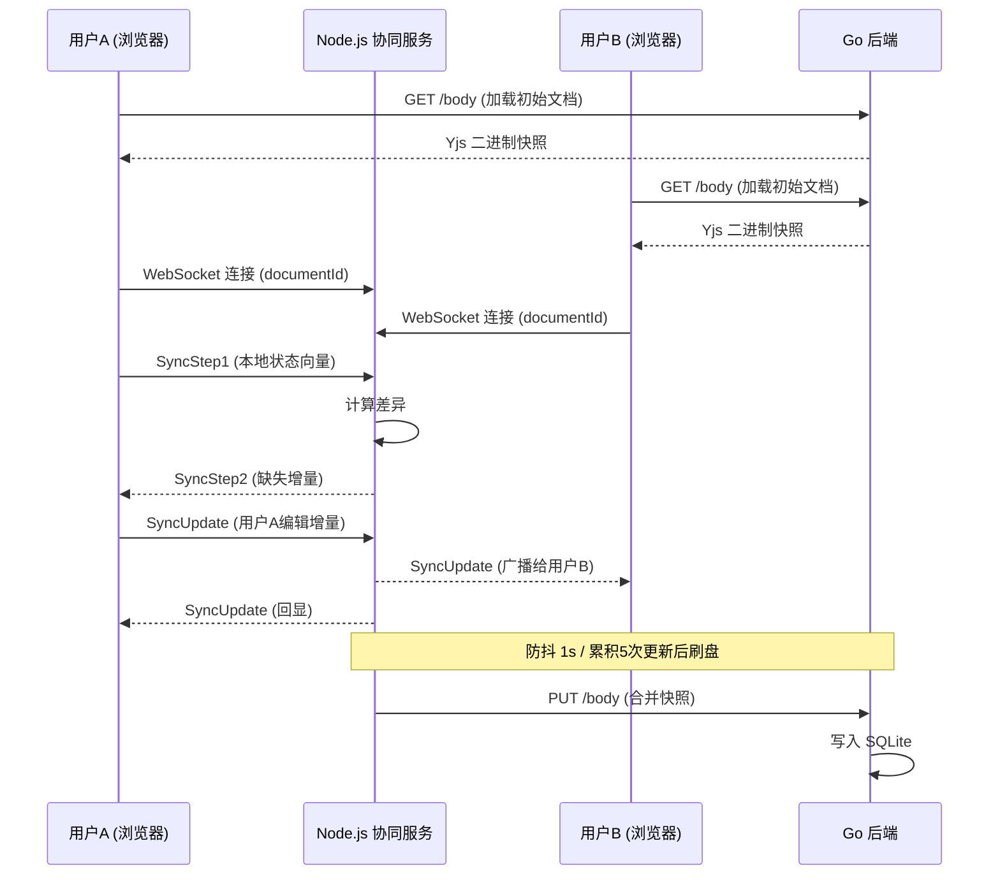
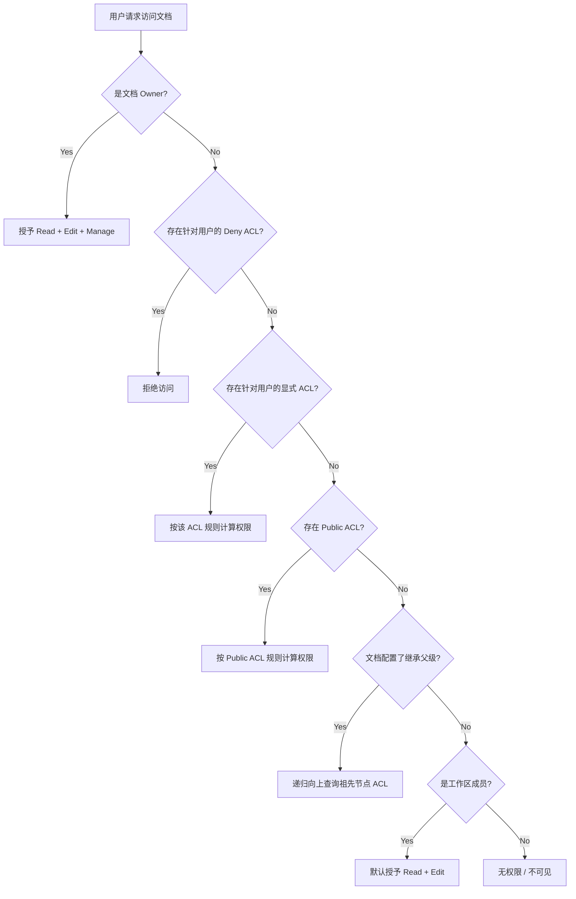
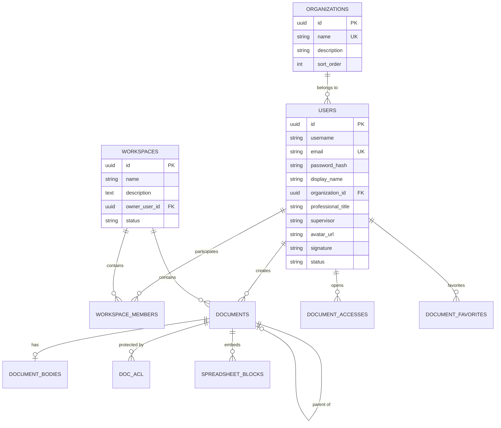
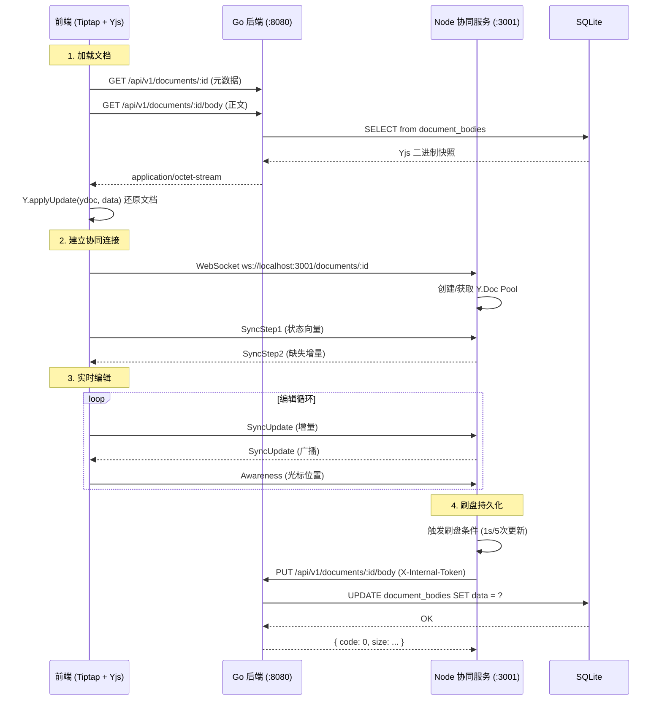
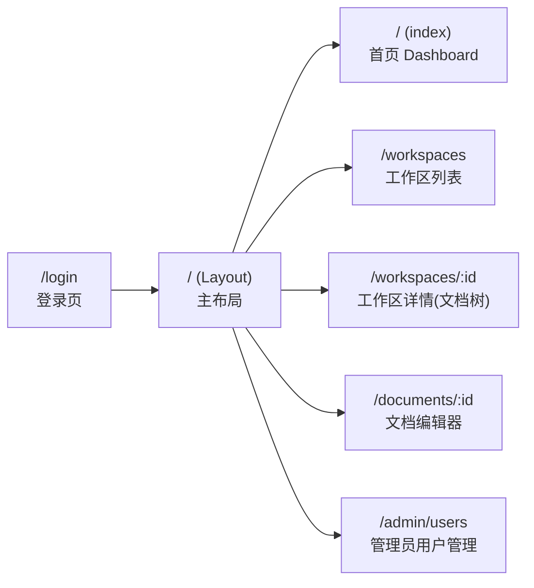

# 科研项目文档管理系统

# 项目需求分析报告

---

**文档版本**：v1.0  
**编制日期**：2026-05-29  
**文档状态**：正式版  
**密级**：内部  

---

## 目录

- [1. 引言与概述](#1-引言与概述)
  - [1.1 项目背景](#11-项目背景)
  - [1.2 产品定位](#12-产品定位)
  - [1.3 核心业务目标](#13-核心业务目标)
  - [1.4 文档范围](#14-文档范围)
  - [1.5 术语定义与缩写](#15-术语定义与缩写)
- [2. 需求分析](#2-需求分析)
  - [2.1 系统角色定义](#21-系统角色定义)
  - [2.2 核心业务流程](#22-核心业务流程)
  - [2.3 功能模块分解](#23-功能模块分解)
- [3. 非功能性需求](#3-非功能性需求)
  - [3.1 性能需求](#31-性能需求)
  - [3.2 安全需求](#32-安全需求)
  - [3.3 可用性需求](#33-可用性需求)
  - [3.4 可扩展性需求](#34-可扩展性需求)
- [4. 系统架构设计](#4-系统架构设计)
  - [4.1 整体架构](#41-整体架构)
  - [4.2 双服务协同设计](#42-双服务协同设计)
  - [4.3 技术栈全景图](#43-技术栈全景图)
- [5. 数据库设计](#5-数据库设计)
  - [5.1 实体关系概述](#51-实体关系概述)
  - [5.2 核心表定义](#52-核心表定义)
  - [5.3 关键设计决策](#53-关键设计决策)
- [6. API 接口设计](#6-api-接口设计)
  - [6.1 设计原则与约定](#61-设计原则与约定)
  - [6.2 接口模块总览](#62-接口模块总览)
  - [6.3 核心接口时序说明](#63-核心接口时序说明)
- [7. 前端架构设计](#7-前端架构设计)
  - [7.1 技术选型](#71-技术选型)
  - [7.2 页面路由结构](#72-页面路由结构)
  - [7.3 核心组件架构](#73-核心组件架构)
  - [7.4 实时协同集成方案](#74-实时协同集成方案)
- [8. 安全与权限体系](#8-安全与权限体系)
  - [8.1 认证机制](#81-认证机制)
  - [8.2 权限位图模型](#82-权限位图模型)
  - [8.3 权限判定核心算法](#83-权限判定核心算法)
  - [8.4 数据安全设计](#84-数据安全设计)
- [9. 项目现状评估](#9-项目现状评估)
  - [9.1 已实现功能清单](#91-已实现功能清单)
  - [9.2 已知缺失与问题](#92-已知缺失与问题)
  - [9.3 功能完成度矩阵](#93-功能完成度矩阵)
- [10. 迭代路线图](#10-迭代路线图)
  - [10.1 第一阶段：协同核心增强](#101-第一阶段协同核心增强)
  - [10.2 第二阶段：用户体验完善](#102-第二阶段用户体验完善)
  - [10.3 第三阶段：高级功能拓展](#103-第三阶段高级功能拓展)
  - [10.4 第四阶段：生产就绪](#104-第四阶段生产就绪)
- [附录 A：开发环境搭建](#附录-a开发环境搭建)

---

## 1. 引言与概述

### 1.1 项目背景

科研机构、高校实验室及研发团队在日常科研活动中产生大量文档资产，包括实验记录、技术报告、文献综述、项目汇报、数据集描述等。然而，传统协作模式存在以下结构性痛点：

- **存储零散**：文档分散在个人电脑、U盘、网盘等多个位置，缺乏统一管理入口；
- **版本冲突**：多人并行修改导致的版本覆盖与内容丢失频繁发生；
- **权限粗放**：无法实现"某个协作者只能阅读某章节、不能下载"级别的精细控制；
- **缺乏审计**：敏感操作无追溯记录，难以满足科研合规与知识产权保护要求。

ResearchAdmin（科研项目文档管理系统）正是为解决上述痛点而设计的一体化协作平台。

### 1.2 产品定位

ResearchAdmin 是一款专为科研团队打造的**文档管理与实时协同编辑系统**。系统以"工作区（Workspace）"为项目组织单元，以"文档树"为内容组织方式，集成 CRDT 实时协同编辑引擎，提供从文档创建到归档的全生命周期管理，以及基于位图（Bitmask）的细粒度权限控制能力。

### 1.3 核心业务目标

| 序号 | 目标 | 说明 |
|------|------|------|
| 1 | **文档全生命周期管理** | 支持科研文档的上传、分类、组织、归档、移动及彻底删除 |
| 2 | **多人无冲突协同编辑** | 基于 CRDT（Yjs）引擎，支持多人同时在线对富文本内容进行实时协同编辑 |
| 3 | **细粒度权限隔离** | 以工作区成员身份为底座、辅以单文档级 ACL 的组合校验，兼顾协作便利性与数据安全 |
| 4 | **版本回溯与合规审计** | 全量保存编辑快照，提供修改历史追溯与操作审计链 |

### 1.4 文档范围

本文档为 ResearchAdmin 项目的**综合需求分析报告**，整合并扩展了以下已有文档的内容：

| 源文档 | 内容侧重 |
|--------|----------|
| `docs/system-prd.md` | 产品逻辑规约：角色定义、业务流程、ACL 算法 |
| `docs/backend-trd.md` | 后端技术规约：架构、API 规范、数据库模型、WebSocket 协议 |
| `docs/frontend-trd.md` | 前端技术规约：技术选型、组件架构、协同集成方案 |

本报告还新增了：非功能性需求、项目现状评估、功能完成度矩阵、分阶段迭代路线图。

### 1.5 术语定义与缩写

| 术语/缩写 | 全称 | 释义 |
|-----------|------|------|
| **Workspace** | 工作区 / 项目空间 | 科研项目的基本组织单元，包含成员、文档树及共享配置 |
| **ACL** | Access Control List | 基于文档级别的访问控制列表，用于定义细粒度权限规则 |
| **CRDT** | Conflict-free Replicated Data Type | 无冲突复制数据类型，一种可支持多人在线实时编辑的分布式算法 |
| **Yjs** | — | CRDT 算法的 JavaScript 实现库 |
| **Tiptap** | — | 基于 ProseMirror 的无头富文本编辑器框架 |
| **JWT** | JSON Web Token | 用于用户认证的无状态令牌 |
| **GORM** | Go Object Relational Mapping | Go 语言的 ORM 框架 |
| **Gin** | — | Go 语言的高性能 HTTP Web 框架 |
| **SPA** | Single Page Application | 单页应用 |
| **PermissionBit** | 权限位图 | 以整数位掩码表达的权限组合（读=1, 编辑=2, 管理=4, 拒绝=8） |

---

## 2. 需求分析

### 2.1 系统角色定义

系统定义了四种角色，角色间存在层次关系：



#### 2.1.1 普通用户 (User)

系统中的基础账号个体。所有人在注册后即获得此角色。

**主要权利与行为**：
- 管理个人账户信息（头像、签名、科研职称等）
- 在被授权的工作区或特定文档内进行阅读、评论或协同编辑
- 通过全局搜索查找可访问的科研文献

#### 2.1.2 工作区成员 (Workspace Member)

在特定工作区内拥有显式成员资格的用户。细分为两个子角色：

| 子角色 | 权限范围 |
|--------|----------|
| **Owner** | 工作区最高管理权：修改名称/描述、管理成员名单与角色、删除工作区 |
| **Member** | 日常协作权限：默认文档读取、新建文档 |

**安全约束**：任何工作区必须至少保留一名 Owner，防止管理真空。

#### 2.1.3 文档拥有者 (Document Owner)

文档的创建者或被转移所有权的独立用户。

**主要权利**：
- 配置文档的细粒度共享策略（分配单用户/所有人权限）
- 拥有文档的完全控制权：移动、归档、彻底删除、权限收回

#### 2.1.4 系统管理员 (System Administrator)

系统超级管理员，负责全局运维与配置。

**主要权利**：
- 管理全系统机构树（组织划分、人员归属调整）
- 维护用户账号状态（激活、禁用、密码重置）
- 审计全系统安全日志与操作链

### 2.2 核心业务流程

#### 2.2.1 文档全生命周期流转



#### 2.2.2 实时协同编辑流程



#### 2.2.3 权限判定流程



### 2.3 功能模块分解

系统共划分为 10 个核心功能模块：

| 模块编号 | 模块名称 | 功能简述 | 优先级 |
|----------|----------|----------|--------|
| M01 | 用户认证与账户管理 | 注册、登录、密码修改、个人资料维护 | P0 |
| M02 | 工作区管理 | 创建/编辑/删除工作区、成员邀请与角色管理 | P0 |
| M03 | 文档树管理 | 文档树状组织、创建、移动、排序 | P0 |
| M04 | 实时协同编辑 | 基于 Yjs 的多人无冲突富文本编辑 | P0 |
| M05 | 协同评论与批注 | 段落级评论插入与讨论线程 | P1 |
| M06 | 细粒度权限控制 (ACL) | 文档级位图权限、显式授权与树状继承 | P0 |
| M07 | 版本历史追溯 | 编辑快照固化和历史对比还原 | P2 |
| M08 | 多维数据表格 | 内嵌表格/数据透视表编辑与导出 | P1 |
| M09 | 文件附件管理 | 文件型文档的上传、预览、更新 | P1 |
| M10 | 系统管理后台 | 组织管理、用户管理、状态维护 | P1 |

#### 2.3.1 用户认证与账户管理 (M01)

- **注册**：用户提交用户名、邮箱、密码、所属组织、职称等基本信息完成注册。密码经 bcrypt 哈希后存储。
- **登录**：邮箱 + 密码验证，颁发 JWT Token（24小时有效），返回用户完整 profile。
- **密码修改**：需提供旧密码验证，更新为新密码。
- **个人资料**：支持更新头像、签名、职称、导师信息等。
- **用户搜索**：提供模糊搜索接口，匹配用户名、邮箱、显示名称，返回脱敏后的用户列表（用于分享授权场景）。

#### 2.3.2 工作区管理 (M02)

- **自动私有空间**：用户注册后自动创建"我的私有空间"工作区。
- **手动创建项目空间**：用户可创建额外的科研项目工作区，设置名称与描述。
- **成员管理**：Owner 可邀请用户加入（赋予 owner 或 member 角色）、修改角色、移除成员。
- **安全约束**：最后一名 Owner 不可被移除或降级。
- **删除**：工作区支持软删除（状态变更为 `deleted`）。

#### 2.3.3 文档树管理 (M03)

- **树状结构**：工作区内文档以树状层级组织，支持无限深度嵌套。
- **文档类型**：支持"富文本文档"（`rich_text`）和"文件附件型文档"（`file`）两种类型。
- **创建文档**：可在根目录或任意父节点下新建文档。
- **文档移动**：通过修改 `parentId` 实现树内移动。
- **防死锁约束**：禁止将节点移动到自身或自身子孙节点下，后端执行拓扑检测拦截。
- **排序**：通过 `sortOrder` 字段控制同级节点顺序。

#### 2.3.4 实时协同编辑 (M04)

- **CRDT 引擎**：基于 Yjs 实现无锁、无冲突的多人实时编辑。
- **编辑器**：采用 Tiptap（ProseMirror）富文本编辑器，支持标题、列表、表格、链接、高亮等格式化功能。
- **连接方式**：通过 WebSocket 与 Node.js 协同服务通信，交换增量更新与 Awareness 状态。
- **持久化机制**：协同服务定期将合并后的全量 Y.Doc 快照通过 HTTP 写回 Go 后端持久化。
- **离线兜底**：支持从 Go 后端 HTTP 接口加载历史文档进入协同。

#### 2.3.5 协同评论与批注 (M05)

- **批注插入**：用户可在正文特定文字或段落上发起评论。
- **讨论线程**：支持针对批注的多人回复讨论。
- **状态管理**：支持将讨论标记为"已解决"，过滤冗余信息。
- **权限**：拥有读取权限的用户即可参与评论。

#### 2.3.6 细粒度权限控制 (M06)

详见 [第 8 章 安全与权限体系](#8-安全与权限体系)。

#### 2.3.7 版本历史追溯 (M07)

- **快照固化**：协同服务刷盘时自动将 Yjs 二进制状态固化为版本快照。
- **历史浏览**：用户可浏览所有版本历史轴（含修改人、修改时间）。
- **差异对比**：支持当前正文与任意历史快照的 Diff 对比。
- **一键还原**：支持将正文恢复到指定历史快照状态。

#### 2.3.8 多维数据表格 (M08)

- **数据表格**：支持在文档内嵌入结构化数据表格，基于 `@antv/s2` 渲染。
- **表格模式**：支持"普通表格"和"数据透视表"两种视图模式。
- **数据录入**：支持行级和单元格级的数据更新。
- **数据导出**：支持将表格数据导出为可用格式。
- **独立快照**：表格数据有独立的存储通道（`spreadsheet_blocks` 表）。

#### 2.3.9 文件附件管理 (M09)

- **上传**：通过 `multipart/form-data` 上传文件，后端生成 `doc_type = file` 的文档记录。
- **预览**：支持 docx、xlsx、pptx、pdf 等常见科研文档格式的在线预览。
- **更新覆盖**：下载原件 → 本地编辑 → 重新上传覆盖，同步更新元数据。
- **下载**：通过文档的 `sourceStorageKey` 获取文件引用。

#### 2.3.10 系统管理后台 (M10)

- **组织管理**：创建/编辑/删除组织机构，批量迁移用户归属。
- **用户管理**：查看全系统用户列表、编辑用户信息、重置密码、激活/禁用账户。
- **权限**：仅系统管理员可访问（通过 `AdminOnly` 中间件守卫）。

---

## 3. 非功能性需求

### 3.1 性能需求

| 指标 | 目标值 | 说明 |
|------|--------|------|
| API 响应时间 (P95) | < 200ms | 常规 CRUD 操作 |
| API 响应时间 (P99) | < 500ms | 含复杂查询（如递归 ACL 计算） |
| 协同消息延迟 | < 100ms | 用户A编辑到用户B的可感知延迟 |
| 首屏加载时间 | < 2s | SPA 初始化加载 |
| 编辑器初始化 | < 1s | 打开文档到可编辑状态 |
| 并发连接数 | 支持 50+ 同时在线 | 单个文档的协同编辑参与者 |
| 数据库写入 | < 50ms | 单条记录写入 |

### 3.2 安全需求

| 需求项 | 实现方式 |
|--------|----------|
| 传输安全 | 所有 REST API 与 WebSocket 通信均需通过 HTTPS/WSS |
| 身份认证 | JWT HS256 令牌，24小时过期 |
| 密码安全 | bcrypt 加盐哈希，不可逆存储 |
| 权限控制 | 请求级 ACL 校验（中间件 + 服务层双重管控） |
| 防暴力破解 | 登录失败次数限制与冷却期 |
| 内部服务通信 | Go 后端与 Node 协同服务之间使用 `GO_INTERNAL_TOKEN` 认证 |
| 数据隔离 | 跨工作区数据自动隔离，禁止跨 workspace 文档移动 |
| 注入防护 | GORM 参数化查询；前端输入 XSS 过滤 |

### 3.3 可用性需求

| 需求项 | 目标 |
|--------|------|
| 系统可用率 | ≥ 99.5%（月度） |
| 数据持久性 | 编辑内容自动保存（防抖机制），减少意外丢失 |
| 离线容错 | 客户端离线时本地 Y.Doc 缓存编辑，重连后自动同步 |
| 错误处理 | 统一 JSON 错误响应格式（code + message），前端全局错误拦截 |
| 浏览器兼容 | Chrome 90+、Edge 90+、Firefox 90+、Safari 15+ |

### 3.4 可扩展性需求

| 需求项 | 说明 |
|--------|------|
| 数据库可替换 | 当前使用 SQLite，架构预留切换到 PostgreSQL 的能力（GORM 提供方言适配） |
| 对象存储 | `sourceStorageKey` 字段支持外部对象存储（如 S3/MinIO）集成 |
| 水平扩展 | Node.js 协同服务设计为无状态，可多实例部署配合负载均衡 |
| 插件化编辑器 | Tiptap 扩展机制支持未来增加新节点类型（公式、绘图等） |

---

## 4. 系统架构设计

### 4.1 整体架构

```
┌─────────────────────────────────────────────────────────┐
│                    React 19 SPA (Vite)                   │
│             Ant Design 6 + Tiptap + Yjs + @antv/s2      │
├──────────┬──────────────────────┬───────────────────────┤
│ REST API │ /api ──▶ :8080       │ localStorage (Token)  │
│ WebSocket│ ws ────▶ :3001       │ Y.Doc (内存)          │
└──────────┴──────────────────────┴───────────────────────┘
       │                              │
       ▼                              ▼
┌──────────────────┐      ┌──────────────────────────────┐
│   Go Backend     │      │   Node.js Collaboration Server│
│   (Gin :8080)    │◄─────│   (ws + y-websocket :3001)   │
│                  │ PUT  │                              │
│  ┌─────────────┐ │/body │  ┌─────────────────────────┐ │
│  │ Auth (JWT)  │ │      │  │ Y.Doc Pool (Worker 线程) │ │
│  │ Middleware   │ │      │  │ ┌───────┐ ┌───────┐    │ │
│  │ Router      │ │      │  │ │Worker1│ │Worker2│... │ │
│  │ Handler     │ │      │  │ └───────┘ └───────┘    │ │
│  │ Service     │ │      │  └─────────────────────────┘ │
│  │ Repository  │ │      │  ┌─────────────────────────┐ │
│  └─────────────┘ │      │  │ Flush Scheduler         │ │
│        │         │      │  │ (防抖 1s/累积5次 → PUT) │ │
│        ▼         │      │  └─────────────────────────┘ │
│  ┌─────────────┐ │      └──────────────────────────────┘
│  │   SQLite    │ │
│  │  (test.db)  │ │
│  └─────────────┘ │
└──────────────────┘
```

### 4.2 双服务协同设计

系统采用 **Go RESTful 服务** 与 **Node.js 协同消息服务** 的双引擎协作模式，实现读写分离：

| 服务 | 职责 | 端口 | 技术栈 |
|------|------|------|--------|
| **Go 主服务** | 用户认证、元数据 CRUD、ACL 鉴权、二进制存储、管理后台 | 8080 | Gin + GORM + SQLite |
| **Node.js 协同服务** | WebSocket 消息分发、Y.Doc CRDT 合并、Awareness 状态同步 | 3001 | ws + y-websocket + yjs |

**解耦持久化机制**：Node 服务不直接访问数据库，而是周期性（防抖间隔 1s，或累积 5 次更新）或在连接断开前，将合并好的全量 Y.Doc 二进制快照通过 HTTP PUT 写回 Go 后端。这实现了"内存高频计算、数据库低频落盘"的高性能架构。

**通信安全**：Node 服务向 Go 后端 PUT 时携带 `GO_INTERNAL_TOKEN` 进行服务间认证。

### 4.3 技术栈全景图

| 层级 | 技术 | 版本/说明 |
|------|------|-----------|
| **后端框架** | Go Gin | Web 框架，提供路由、中间件、JSON 序列化 |
| **ORM** | GORM 2.0 | 对象关系映射，支持 Auto-Migration |
| **数据库** | SQLite | 嵌入式数据库（架构支持切换 PostgreSQL） |
| **认证** | JWT (HS256) | 无状态令牌认证，24h TTL |
| **API 文档** | Swagger (swaggo) | 从代码注解自动生成 |
| **协同算法** | Yjs (CRDT) | 无冲突复制数据类型 |
| **WebSocket** | ws + y-websocket | Node.js 原生 WebSocket 库 |
| **前端框架** | React 19 + TypeScript | SPA 架构 |
| **构建工具** | Vite 7 | 极速 HMR 与生产构建 |
| **UI 库** | Ant Design 6 | 企业级 UI 组件，中文支持 |
| **富文本编辑器** | Tiptap 3 (ProseMirror) | 无头编辑器，扩展丰富 |
| **数据表格** | @antv/s2 | 多维数据透视表 |
| **图表** | @antv/g2 | 数据可视化 |
| **文件预览** | docx / xlsx / mammoth / pptx-preview | 科研文档格式在线预览 |
| **包管理** | pnpm (优先) / npm | Monorepo 风格管理 |
| **开发编排** | scripts/dev.mjs | 一键启动三服务（Go + Node + Vite） |

---

## 5. 数据库设计

### 5.1 实体关系概述



### 5.2 核心表定义

#### 5.2.1 用户表 (`users`)

| 字段 | 类型 | 约束 | 说明 |
|------|------|------|------|
| id | char(36) | PK, UUID v4 | 用户唯一标识 |
| username | varchar(255) | NOT NULL | 登录用户名 |
| email | varchar(255) | UNIQUE, NOT NULL | 电子邮箱 |
| password_hash | varchar(255) | NOT NULL, 排除 JSON | bcrypt 密码哈希 |
| display_name | varchar(64) | — | 显示名称 |
| organization_id | char(36) | FK → organizations.id | 所属组织 |
| professional_title | varchar(32) | — | 职称枚举（professor/lecturer/doctoral_student/researcher 等） |
| supervisor | varchar(255) | — | 导师姓名 |
| avatar_url | text | — | 头像 URL |
| signature | text | — | 个性签名 |
| status | varchar(32) | DEFAULT 'active' | active / disabled |
| last_login_at | datetime | — | 上次登录时间 |

#### 5.2.2 组织表 (`organizations`)

| 字段 | 类型 | 约束 | 说明 |
|------|------|------|------|
| id | char(36) | PK, UUID v4 | 组织唯一标识 |
| name | varchar(255) | UNIQUE, NOT NULL | 组织名称 |
| description | text | — | 组织描述 |
| sort_order | int | — | 排序权重 |

#### 5.2.3 工作区表 (`workspaces`)

| 字段 | 类型 | 约束 | 说明 |
|------|------|------|------|
| id | char(36) | PK, UUID v4 | 工作区标识 |
| name | varchar(128) | NOT NULL | 项目名称 |
| description | text | — | 项目描述 |
| owner_user_id | char(36) | INDEX, FK | 创建者用户 ID |
| status | varchar(32) | DEFAULT 'active', INDEX | active / deleted |

#### 5.2.4 工作区成员表 (`workspace_members`)

| 字段 | 类型 | 约束 | 说明 |
|------|------|------|------|
| id | char(36) | PK, UUID v4 | 关联 ID |
| workspace_id | char(36) | UNIQUE(ws_id, user_id), FK | 工作区 ID |
| user_id | char(36) | UNIQUE(ws_id, user_id), FK | 用户 ID |
| role | varchar(32) | NOT NULL | owner / member |

**联合唯一索引** `idx_workspace_member (workspace_id, user_id)` 确保每个用户在同一工作区无重复记录。

#### 5.2.5 文档表 (`documents`)

| 字段 | 类型 | 约束 | 说明 |
|------|------|------|------|
| id | char(36) | PK, UUID v4 | 文档唯一标识 |
| workspace_id | char(36) | INDEX, FK | 所属工作区 |
| parent_id | char(36) | NULLABLE, FK(自引用) | 父节点 ID，null 为根目录 |
| title | varchar(255) | NOT NULL | 文档标题 |
| summary | text | — | 文档摘要 |
| owner_user_id | char(36) | FK | 创建者 |
| doc_type | varchar(32) | NOT NULL | rich_text / file |
| status | varchar(32) | DEFAULT 'active' | active / archived / deleted |
| sort_order | int | DEFAULT 1000 | 排序权重 |
| source_storage_key | varchar(255) | — | 文件类型文档的外部存储键 |

**联合索引** `idx_documents_parent_sort (workspace_id, parent_id, sort_order)` 优化树状查询性能。

#### 5.2.6 文档正文表 (`document_bodies`)

| 字段 | 类型 | 约束 | 说明 |
|------|------|------|------|
| id | char(36) | PK, UUID v4 | 主键 |
| document_id | char(36) | UNIQUE, FK | 文档 ID（一对一） |
| body_type | varchar(32) | DEFAULT 'yjs_state' | yjs_state / pdf / word / excel 等 |
| data | blob | 排除 JSON | 二进制数据 |
| size | bigint | — | 数据字节数 |

#### 5.2.7 访问控制表 (`doc_acl`)

| 字段 | 类型 | 约束 | 说明 |
|------|------|------|------|
| id | char(36) | PK, UUID v4 | 规则主键 |
| workspace_id | char(36) | INDEX | 冗余工作区 ID |
| document_id | char(36) | UNIQUE(doc, type, subj) | 目标文档 ID |
| subject_type | varchar(32) | UNIQUE(doc, type, subj) | user / public |
| subject_id | char(36) | NULLABLE, UNIQUE(doc, type, subj) | 用户 ID（public 时为空） |
| permission_bit | int | NOT NULL | 权限位图值（1/2/3/4/5/6/7/8） |
| inherit | bool | DEFAULT false | 是否允许继承 |
| created_by | char(36) | FK | 授权操作人 |

**联合唯一索引** `idx_doc_acl_subject (document_id, subject_type, subject_id)` 确保每个主体对每个文档只有一条规则。

#### 5.2.8 表格数据块表 (`spreadsheet_blocks`)

| 字段 | 类型 | 约束 | 说明 |
|------|------|------|------|
| id | varchar(36) | PK | 块 ID |
| document_id | char(36) | FK | 所属文档 |
| block_id | varchar(64) | — | 块标识 |
| title | varchar(128) | — | 表格标题 |
| mode | varchar(32) | DEFAULT 'table' | pivot / table |
| config | text (JSON) | — | 配置信息 |
| records | text (JSON) | — | 行数据 |
| filters | text (JSON) | — | 筛选条件 |
| sort | text (JSON) | — | 排序规则 |

#### 5.2.9 文档访问记录表 (`document_accesses`)

| 字段 | 类型 | 约束 | 说明 |
|------|------|------|------|
| id | char(36) | PK, UUID v4 | 主键 |
| user_id | char(36) | UNIQUE(user, doc), FK | 用户 ID |
| document_id | char(36) | UNIQUE(user, doc), FK | 文档 ID |
| opened_at | datetime | — | 最近打开时间 |

用于首页"最近打开"列表。

#### 5.2.10 文档收藏表 (`document_favorites`)

| 字段 | 类型 | 约束 | 说明 |
|------|------|------|------|
| id | char(36) | PK, UUID v4 | 主键 |
| user_id | char(36) | UNIQUE(user, doc), FK | 用户 ID |
| document_id | char(36) | UNIQUE(user, doc), FK | 文档 ID |

用于首页"我收藏的"列表。

### 5.3 关键设计决策

| 决策点 | 方案 | 理由 |
|--------|------|------|
| ID 生成 | UUID v4（36 位字符串） | 分布式友好，无自增冲突，全局唯一 |
| 软删除 | status 字段标记（active/deleted） | 保留数据可恢复性，满足审计需求 |
| 文档正文分离 | `document_bodies` 独立表 | 解耦元数据查询与大数据读取，元数据查询轻量 |
| ACL 冗余 workspace_id | 在 doc_acl 表冗余存储 | 减少 JOIN 次数，加速权限判定 |
| 树结构存储 | parent_id 自引用 | 经典邻接表模型，配合 GORM 支持递归查询 |
| 权限位图 | 整型 bitmask（1/2/4/8） | 单字段表达多权限组合，位运算 O(1) 复杂度 |

---

## 6. API 接口设计

### 6.1 设计原则与约定

#### 6.1.1 RESTful 规范

| 约定项 | 规则 |
|--------|------|
| URL 前缀 | 全部接口以 `/api/v1` 为前缀 |
| 资源命名 | 复数名词（`workspaces`、`documents`、`users`） |
| ID 参数 | 路径参数 `:workspaceId`、`:documentId` 均为 36 位 UUID 字符串 |
| HTTP 方法 | GET（查询）、POST（创建）、PATCH（部分更新）、PUT（全量更新）、DELETE（删除） |

#### 6.1.2 统一响应格式

**成功响应**：
```json
{
  "code": 0,
  "message": "success",
  "data": { }
}
```

**错误响应**：
```json
{
  "code": 401,
  "message": "未授权访问",
  "data": null
}
```

- `code` = 0 表示成功；非 0 时使用 HTTP 状态码（400/401/403/404/409/500）
- 二进制接口（`/body`）不受此格式约束，直接返回/接收 `application/octet-stream`

#### 6.1.3 鉴权规则

| 接口类别 | 鉴权方式 |
|----------|----------|
| 公开接口（登录、注册） | 无需 Token |
| 普通保护接口 | 请求头携带 `Authorization: Bearer {jwt_token}` |
| 管理员接口 | JWT + AdminOnly 中间件 |
| 内部服务接口（body PUT） | 请求头携带 `X-Internal-Token: {go_internal_token}` |

### 6.2 接口模块总览

系统共设计 **50+ 个 RESTful 接口**，按模块分类如下：

#### 6.2.1 认证模块 (Auth) — 5 个接口

| 方法 | 路径 | 说明 | 鉴权 |
|------|------|------|------|
| POST | `/api/v1/auth/login` | 登录 | 无 |
| POST | `/api/v1/auth/register` | 注册 | 无 |
| PUT | `/api/v1/auth/password` | 修改密码 | JWT |
| PUT | `/api/v1/auth/profile` | 更新个人资料 | JWT |
| GET | `/api/v1/users/search` | 模糊搜索用户 | JWT |

#### 6.2.2 工作区模块 (Workspace) — 5 个接口

| 方法 | 路径 | 说明 | 权限 |
|------|------|------|------|
| POST | `/api/v1/workspaces` | 创建工作区 | JWT |
| GET | `/api/v1/workspaces` | 列出我的工作区 | JWT |
| GET | `/api/v1/workspaces/:workspaceId` | 获取目录树（分页） | Member |
| PATCH | `/api/v1/workspaces/:workspaceId` | 更新工作区信息 | Owner |
| DELETE | `/api/v1/workspaces/:workspaceId` | 软删除工作区 | Owner |

#### 6.2.3 工作区成员模块 — 4 个接口

| 方法 | 路径 | 说明 | 权限 |
|------|------|------|------|
| GET | `/api/v1/workspaces/:workspaceId/members` | 成员列表 | Member |
| POST | `/api/v1/workspaces/:workspaceId/members` | 添加成员 | Owner |
| PATCH | `/api/v1/workspaces/:workspaceId/members/:userId` | 修改角色 | Owner |
| DELETE | `/api/v1/workspaces/:workspaceId/members/:userId` | 移除成员 | Owner |

#### 6.2.4 文档模块 (Document) — 12 个接口

| 方法 | 路径 | 说明 | 权限 |
|------|------|------|------|
| POST | `/api/v1/workspaces/:workspaceId/documents` | 创建文档 | Edit |
| POST | `/api/v1/workspaces/:workspaceId/documents/upload` | 上传文件型文档 | Edit |
| GET | `/api/v1/documents/home` | 首页文档列表 | JWT |
| GET | `/api/v1/documents/:documentId` | 获取文档元数据 | Read |
| PATCH | `/api/v1/documents/:documentId` | 更新文档信息 | Edit |
| POST | `/api/v1/documents/:documentId/move` | 移动文档 | Manage |
| POST | `/api/v1/documents/:documentId/favorite` | 收藏 | Read |
| DELETE | `/api/v1/documents/:documentId/favorite` | 取消收藏 | Read |
| POST | `/api/v1/documents/:documentId/archive` | 归档 | Manage |
| POST | `/api/v1/documents/:documentId/restore` | 恢复归档 | Manage |
| DELETE | `/api/v1/documents/:documentId` | 删除 | Manage |
| GET | `/api/v1/documents/:documentId/download` | 下载文件引用 | Read |

#### 6.2.5 权限控制模块 (ACL) — 5 个接口

| 方法 | 路径 | 说明 | 权限 |
|------|------|------|------|
| GET | `/api/v1/documents/:documentId/acl` | ACL 规则列表 | Manage |
| POST | `/api/v1/documents/:documentId/acl` | 新增 ACL 规则 | Manage |
| PATCH | `/api/v1/documents/:documentId/acl/:aclId` | 更新 ACL 规则 | Manage |
| DELETE | `/api/v1/documents/:documentId/acl/:aclId` | 删除 ACL 规则 | Manage |
| GET | `/api/v1/documents/:documentId/my-permission` | 我的最终权限 | JWT |

#### 6.2.6 文档正文模块 (Body) — 2 个接口

| 方法 | 路径 | 说明 | 权限 |
|------|------|------|------|
| GET | `/api/v1/documents/:documentId/body` | 读取文档正文（二进制） | Read |
| PUT | `/api/v1/documents/:documentId/body` | 写入/更新文档正文（二进制） | Edit |

#### 6.2.7 表格数据模块 (Spreadsheet) — 7 个接口

| 方法 | 路径 | 说明 | 权限 |
|------|------|------|------|
| GET | `/api/v1/documents/:documentId/spreadsheets/:blockId` | 获取表格块 | Read |
| PATCH | `/api/v1/documents/:documentId/spreadsheets/:blockId` | 更新表格配置 | Edit |
| POST | `/api/v1/documents/:documentId/spreadsheets/:blockId/records` | 添加行数据 | Edit |
| PATCH | `/api/v1/documents/:documentId/spreadsheets/:blockId/cell` | 更新单元格 | Edit |
| GET | `/api/v1/documents/:documentId/spreadsheets/:blockId/body` | 获取表格快照 | Read |
| PUT | `/api/v1/documents/:documentId/spreadsheets/:blockId/body` | 写入表格快照 | Edit |
| GET | `/api/v1/documents/:documentId/spreadsheets/:blockId/export` | 导出表格数据 | Read |

#### 6.2.8 管理员模块 (Admin) — 11 个接口

**组织管理**：

| 方法 | 路径 | 说明 |
|------|------|------|
| GET | `/api/v1/admin/organizations` | 全部组织列表 |
| POST | `/api/v1/admin/organizations` | 创建组织 |
| PATCH | `/api/v1/admin/organizations/:orgId` | 编辑组织 |
| DELETE | `/api/v1/admin/organizations/:orgId` | 删除组织 |
| POST | `/api/v1/admin/organizations/:orgId/move-users` | 批量迁移用户 |

**用户管理**：

| 方法 | 路径 | 说明 |
|------|------|------|
| GET | `/api/v1/admin/users` | 用户列表 |
| POST | `/api/v1/admin/users` | 创建用户 |
| GET | `/api/v1/admin/users/:userId` | 用户详情 |
| PATCH | `/api/v1/admin/users/:userId` | 编辑用户 |
| DELETE | `/api/v1/admin/users/:userId` | 删除用户 |
| POST | `/api/v1/admin/users/:userId/move` | 迁移用户组织 |
| POST | `/api/v1/admin/users/:userId/reset-password` | 重置密码 |
| POST | `/api/v1/admin/users/:userId/status` | 激活/禁用用户 |

### 6.3 核心接口时序说明

#### 6.3.1 文档协同编辑完整流程



---

## 7. 前端架构设计

### 7.1 技术选型

| 技术 | 版本 | 用途 |
|------|------|------|
| React | 19 | UI 框架 |
| TypeScript | — | 类型安全 |
| Vite | 7 | 构建与开发服务器 |
| Ant Design | 6 | UI 组件库（含中文 locale） |
| React Router | v7 | 客户端路由 |
| Tiptap | 3 | 富文本编辑器核心 |
| Yjs | — | CRDT 协同数据模型 |
| @antv/s2 | — | 多维数据透视表 |
| @antv/g2 | — | 图表绘制 |
| less | — | CSS 预处理 |

### 7.2 页面路由结构



| 路由 | 页面组件 | 说明 |
|------|----------|------|
| `/login` | LoginPage | 登录/注册页面，未登录用户自动重定向 |
| `/` | Layout | 应用主布局（侧边栏导航 + 顶栏 + 内容区） |
| `/` (index) | HomePage | 首页仪表盘：我创建的、最近打开、我收藏的 |
| `/workspaces` | WorkspaceListPage | 工作区/项目总览列表 |
| `/workspaces/:workspaceId` | WorkspaceDetailPage | 工作区详情：左侧文档树 + 右侧文档列表 |
| `/documents/:documentId` | DocumentEditorPage | 核心编辑页面：富文本编辑器 + 表格 + 文件预览 |
| `/admin/users` | AdminUsersPage | 管理员后台：用户管理 |

所有页面组件均通过 `React.lazy()` 实现代码分割，减少首屏加载体积。

### 7.3 核心组件架构

#### 7.3.1 DocumentEditorPage 组件树

```
DocumentEditorPage
├── EditorContextMenu           # 右键菜单
├── CommentSelectionBubble      # 评论选区气泡
├── DiscussionSidebar           # 评论讨论侧边栏
├── TiptapWangToolbar           # 编辑器工具栏
├── WangEditor                  # Tiptap 编辑器实例
│   ├── Collaboration (Yjs)     # 协同编辑插件
│   ├── StarterKit              # 基础格式化套件
│   ├── Table                   # 表格扩展
│   ├── Highlight               # 高亮扩展
│   ├── Link                    # 链接扩展
│   └── DragHandle              # 拖拽手柄扩展
├── SpreadsheetConfigPanel      # 表格配置面板
├── TableBubbleMenu             # 表格气泡菜单
├── ACLModal                    # 权限分享弹窗
└── VersionHistory              # 版本历史面板（待实现）
```

#### 7.3.2 全局状态管理

| Context | 职责 | 存储方式 |
|---------|------|----------|
| **AuthContext** | 登录状态、JWT Token、用户 Profile | localStorage 持久化 |
| **PrivateSpaceContext** | 用户私有空间文档树的 CRUD 操作 | 内存状态 |

使用 React Context + useReducer 模式，避免引入重型状态管理库，保持架构轻量。

#### 7.3.3 API 服务层

前端 API 层采用分层设计：

```
页面组件 → 业务 Hooks → 服务模块 (services/*.ts) → Fetch 封装 (api.ts) → Go 后端
```

**Fetch 封装层** (`services/api.ts`)：
- 自动注入 `Authorization: Bearer {token}` 请求头
- 401 响应自动重定向到登录页
- 统一 JSON 解析与错误处理

**服务模块**：
| 模块文件 | 对应后端模块 |
|----------|-------------|
| `auth.ts` | 认证（登录/注册/修改密码） |
| `document.ts` | 文档 CRUD + 正文读写 |
| `workspace.ts` | 工作区管理 |
| `acl.ts` | 权限规则管理 |
| `admin.ts` | 管理员后台 |
| `user.ts` | 用户搜索 |
| `search.ts` | 全局搜索 |
| `comment.ts` | 评论管理 |

### 7.4 实时协同集成方案

#### 7.4.1 当前状态（HTTP 单向模式）

```
加载：GET /body → Y.applyUpdate(ydoc, data) → Tiptap 渲染
保存：Y.encodeStateAsUpdate(ydoc) → PUT /body → 后端持久化
```

当前用户点击"保存"按钮手动触发持久化，不支持多人实时协同。

#### 7.4.2 目标状态（WebSocket 实时模式）

```
初始化：
  1. GET /body (Go 后端) → 加载初始快照兜底
  2. new WebsocketProvider('ws://localhost:3001', 'documents/:id', ydoc)
  3. 自动完成 SyncStep1/Step2 握手同步

编辑：
  用户输入 → Tiptap → Collaboration Extension → Y.Doc → WebsocketProvider → Node 协同服务
  Node 协同服务 → 广播 SyncUpdate → 其他用户 WebsocketProvider → Y.Doc → Tiptap 更新

Awareness：
  从 provider.awareness 获取其他用户光标位置 → @tiptap/extension-collaboration-caret 渲染
```

#### 7.4.3 集成代码结构

```typescript
// useDocumentEditor.ts 中的核心集成逻辑

import { WebsocketProvider } from 'y-websocket';
import Collaboration from '@tiptap/extension-collaboration';
import CollaborationCursor from '@tiptap/extension-collaboration-caret';

const ydoc = useMemo(() => new Y.Doc(), [documentId]);

// 初始化 WebSocket 连接
useEffect(() => {
  if (!documentId) return;
  const provider = new WebsocketProvider(
    'ws://localhost:3001',
    `documents/${documentId}`,
    ydoc
  );
  return () => provider.destroy();
}, [documentId, ydoc]);

// 创建编辑器
const editor = useEditor({
  extensions: [
    StarterKit.configure({ undoRedo: false }),
    Collaboration.configure({ document: ydoc }),
    CollaborationCursor.configure({ provider, user: currentUser }),
  ],
});
```

---

## 8. 安全与权限体系

### 8.1 认证机制

#### 8.1.1 JWT 令牌管理

```
┌──────────┐    POST /auth/login     ┌───────────┐
│  React   │────────────────────────▶│ Go Backend│
│  Client  │◀─────────────────────── │           │
│          │  {accessToken, user}    └───────────┘
│          │
│  ┌───────▼────────┐
│  │ localStorage   │  存储 token + user
│  └───────┬────────┘
│          │
│  ┌───────▼────────┐
│  │ fetch 拦截器   │  自动注入 Authorization: Bearer {token}
│  └────────────────┘
└──────────┘
```

- **算法**：HS256（HMAC-SHA256）
- **有效期**：24 小时（通过 `JWT_TTL_SECONDS` 环境变量配置）
- **存储**：客户端 `localStorage`，通过 AuthContext 管理生命周期
- **刷新策略**：当前未实现 token 自动刷新，未来需增加 refresh token 机制

#### 8.1.2 服务间通信认证

Node.js 协同服务向 Go 后端写入文档正文时，需携带内部令牌：

```
PUT /api/v1/documents/:id/body
Headers:
  Content-Type: application/octet-stream
  X-Internal-Token: {GO_INTERNAL_TOKEN}  ← 环境变量注入
```

Go 后端中间件验证该令牌，确保仅受信服务可写入文档正文。

### 8.2 权限位图模型

系统采用**位掩码（Bitmask）**方式存储和运算权限，单字段（`permission_bit`）表达多重权限组合。

| 权限 | 二进制位 | 十进制值 | 说明 |
|------|----------|----------|------|
| **Read** | `0b0001` | 1 | 查看文档元数据及正文、查看评论 |
| **Edit** | `0b0010` | 2 | 加入协同编辑、修改正文、发表和回复评论 |
| **Manage** | `0b0100` | 4 | 配置分享、修改 ACL 规则、归档、转移所有权 |
| **Deny** | `0b1000` | 8 | 强行阻断任何访问（最高优先级） |

**组合示例**：

| 组合值 | 含义 |
|--------|------|
| 3 (1\|2) | Read + Edit（可读可编辑，但不能管理） |
| 7 (1\|2\|4) | Read + Edit + Manage（完全控制权） |
| 1 | 只读 |
| 8 | 拒绝 |

**位运算工具函数**：

```go
const (
    PermissionRead   = 1  // 0x01
    PermissionEdit   = 2  // 0x02
    PermissionManage = 4  // 0x04
    PermissionDeny   = 8  // 0x08
)

// 判断是否拥有某权限
func HasPermission(bit int, perm int) bool {
    return bit&perm == perm
}

// 组合权限
func Combine(perms ...int) int {
    result := 0
    for _, p := range perms {
        result |= p
    }
    return result
}
```

### 8.3 权限判定核心算法

当用户尝试对某个文档执行操作时，后端按以下**优先级链**（由高到低）计算最终权限：

```
步骤 1: Owner 优先判定
  └─ if (userID == doc.OwnerUserID) OR (userID 是所属工作区的 Owner)
      → 直接返回 Read | Edit | Manage (7)，跳过后续所有检查

步骤 2: Deny 一票否决
  └─ if 文档存在针对该用户的 permission_bit == 8 的 ACL 规则
      → 拒绝访问

步骤 3: 显式 User ACL
  └─ if 文档存在 subjectType="user" AND subjectId=userID 的 ACL 规则
      → 按该规则的 permission_bit 判定

步骤 4: Public ACL
  └─ if 文档存在 subjectType="public" 的 ACL 规则
      → 按该规则的 permission_bit 判定

步骤 5: 树状继承递归
  └─ if 文档的 ACL 规则标记了 inherit=true
      → 沿着 parentId 向上递归查找配置了显式 ACL 的祖先节点
      → 应用最先找到的祖先节点 ACL

步骤 6: 工作区默认底座
  └─ if 用户是工作区成员 (workspace_members 中有记录)
      → 默认授予 Read | Edit (3)
  └─ else
      → 不可见 (无权限)
```

### 8.4 数据安全设计

| 安全维度 | 措施 |
|----------|------|
| **密码存储** | bcrypt 加盐哈希，不可逆存储 |
| **跨工作区隔离** | 文档移动操作禁止跨 workspace；每个查询强制过滤 `workspace_id` |
| **防死锁移动** | 文档移动时拓扑检测：禁止将节点移入自身或其子孙节点 |
| **最后 Owner 保护** | 禁止移除/降级工作区最后一名 Owner |
| **敏感字段隐藏** | `password_hash` 在 GORM 模型中标记 `json:"-"`，永不序列化输出 |
| **搜索脱敏** | 用户搜索结果仅返回公开可访问的属性，不暴露敏感元数据 |
| **内部接口守卫** | body PUT 接口需验证 `X-Internal-Token`，防止外部直接写入 |

---

## 9. 项目现状评估

### 9.1 已实现功能清单

| 模块 | 已实现功能 | 实现程度 |
|------|-----------|----------|
| **M01 用户认证** | 注册、登录、JWT 鉴权、密码修改、个人资料更新 | ✅ 100% |
| **M02 工作区管理** | 创建/列表/详情/编辑/删除、成员 CRUD、角色管理 | ✅ 100% |
| **M03 文档树管理** | 树状结构 CRUD、移动（含拓扑检测）、排序、归档/恢复/删除 | ✅ 100% |
| **M04 实时协同** | Yjs + Tiptap 编辑器、Y.Doc 本地编辑与 HTTP 加载/保存 | ⚠️ 60% |
| **M05 协同评论** | 后端未实现评论 API | ❌ 0% |
| **M06 权限 ACL** | 完整位图模型、ACL CRUD、优先级算法、my-permission 预检 | ✅ 100% |
| **M07 版本历史** | 后端未实现版本快照管理 | ❌ 0% |
| **M08 多维表格** | 后端表格 API 完整，前端 S2 渲染集成中 | ⚠️ 70% |
| **M09 文件附件** | 上传/下载/预览/更新覆盖（PUT + PATCH），含前端完整流程 | ✅ 100% |
| **M10 管理后台** | 组织 CRUD、用户 CRUD、状态管理、密码重置 | ✅ 100% |
| **用户搜索** | 模糊搜索 API + 前端动态下拉选择 | ✅ 100% |
| **首页 Dashboard** | 我创建的/最近打开/我收藏的 三标签列表 | ✅ 100% |
| **Swagger 文档** | 后端自动生成 API 文档 | ✅ 100% |
| **开发脚本** | 一键启动三服务 (dev.mjs)、环境配置脚本 | ✅ 100% |

### 9.2 已知缺失与问题

#### 9.2.1 关键缺失 #1 — WebSocket 实时协同未接通

| 项目 | 详情 |
|------|------|
| **现状** | 前端未集成 `y-websocket` 的 `WebsocketProvider`，编辑器以 HTTP 单向模式工作（加载+手动保存） |
| **影响** | 无法实现多人实时协同编辑，核心卖点未达成 |
| **根因** | 前端 `useDocumentEditor.ts` 缺少 WebSocket 连接初始化代码 |
| **修复方向** | 安装 `y-websocket` 依赖 → 初始化 `WebsocketProvider` → 绑定 `CollaborationCursor` |

#### 9.2.2 关键缺失 #2 — 协同感知与评论 UI 未整合

| 项目 | 详情 |
|------|------|
| **现状** | 后端无评论 API，前端无协作者光标展示区、无评论批注抽屉界面 |
| **影响** | 协作者之间无法感知彼此光标位置，无法进行段落级批注讨论 |
| **根因** | 评论功能尚未进入开发阶段 |
| **修复方向** | 后端新增评论 API → 前端构建 DiscussionSidebar + CollaborationCursor 显示 |

#### 9.2.3 关键缺失 #3 — 版本历史未实现

| 项目 | 详情 |
|------|------|
| **现状** | 后端 `document_bodies` 表仅存储最新快照，无历史版本管理机制 |
| **影响** | 无法回溯文档历史版本，不符合科研合规审计要求 |
| **修复方向** | 新增 `document_snapshots` 表 → 每次刷盘创建版本记录 → 前端版本对比/还原 UI |

### 9.3 功能完成度矩阵

```
模块完成度总览：

M01 用户认证      ████████████████████ 100%
M02 工作区管理    ████████████████████ 100%
M03 文档树管理    ████████████████████ 100%
M04 实时协同      ████████████░░░░░░░░  60%
M05 协同评论      ░░░░░░░░░░░░░░░░░░░░   0%
M06 权限 ACL       ████████████████████ 100%
M07 版本历史      ░░░░░░░░░░░░░░░░░░░░   0%
M08 多维表格      ██████████████░░░░░░  70%
M09 文件附件      ████████████████████ 100%
M10 管理后台      ████████████████████ 100%

整体完成度: 约 73%
```

```
优先级分布：
  P0（核心功能，当前阻塞）: M04 协同连接、M05 评论功能
  P1（重要增强）: M08 表格完善、协作感知 UI
  P2（后续迭代）: M07 版本历史
```

---

## 10. 迭代路线图

### 10.1 第一阶段：协同核心增强

**目标**：实现真正的多人实时协同编辑，里程碑为"两个用户可同时编辑同一文档且实时互见对方更改"。

**时间估算**：1-2 周

| 任务编号 | 任务 | 说明 |
|----------|------|------|
| P1-1 | 前端安装 `y-websocket` 依赖 | 修改 `package.json`，安装 `y-websocket` 和 `@tiptap/extension-collaboration-caret` |
| P1-2 | 集成 `WebsocketProvider` | 在 `useDocumentEditor.ts` 中初始化 WebSocket 连接，管理连接生命周期 |
| P1-3 | 实现加载双通道策略 | WebSocket 初始同步 + HTTP 兜底加载，确保首次打开不丢内容 |
| P1-4 | 移除手动保存按钮 | 由 WebSocket 自动同步替代 HTTP 手动保存 |
| P1-5 | 集成 Awareness 协作光标 | 使用 `@tiptap/extension-collaboration-caret` 展示协作者光标位置和用户名 |
| P1-6 | 增加在线用户列表 | 编辑器顶部展示当前在线协作者头像列表 |
| P1-7 | 协同连接异常处理 | 重连机制、断线提示、离线编辑队列 |
| P1-8 | 联调测试 | 两用户同时编辑，验证增量同步、冲突合并、光标位置正确性 |

### 10.2 第二阶段：用户体验完善

**目标**：完善协作体验，新增评论批注功能，提升 ACL 授权便利性。

**时间估算**：2-3 周

| 任务编号 | 任务 | 说明 |
|----------|------|------|
| P2-1 | 后端评论 API | 新增 `comments` 模块：创建评论/回复/标记已解决/列表查询 |
| P2-2 | 评论数据库模型 | 新增 `comments` 和 `comment_threads` 表 |
| P2-3 | 前端评论选区气泡 | 选中文字后弹出"添加评论"气泡按钮 |
| P2-4 | 前端讨论侧边栏 | 完善 `DiscussionSidebar` 组件，展示评论列表与回复功能 |
| P2-5 | 评论排序与过滤 | 支持按时间/状态（未解决/已解决）排序与过滤 |
| P2-6 | ACL 授权体验优化 | 搜索输入防抖、最近协作者快捷选择、批量授权模板 |
| P2-7 | 文档移动拖拽 | 文档树支持拖拽移动节点（前端实现拖拽触发后端 move API） |
| P2-8 | 通知系统基础 | 文档被分享/被评论时触发通知提醒 |

### 10.3 第三阶段：高级功能拓展

**目标**：完善多维表格、实现版本历史，增加数据导出能力。

**时间估算**：3-4 周

| 任务编号 | 任务 | 说明 |
|----------|------|------|
| P3-1 | 版本快照存储 | 新增 `document_snapshots` 表，每次刷盘新建快照记录 |
| P3-2 | 版本历史 API | 列表查询/单版本详情/版本对比 Diff/一键还原 |
| P3-3 | 前端版本历史面板 | `VersionHistory` 组件：时间轴、版本列表、Diff 视图、还原按钮 |
| P3-4 | 表格功能完善 | 筛选/排序/分组/公式计算/图表联动 |
| P3-5 | 数据导出增强 | 文档导出为 PDF/Word；表格导出为 CSV/Excel |
| P3-6 | 全局搜索增强 | 全文检索（搜索文档正文内容，非仅标题） |
| P3-7 | 批量操作 | 批量归档/删除文档、批量修改权限 |

### 10.4 第四阶段：生产就绪

**目标**：系统性能优化、安全加固、CI/CD 部署管线建设。

**时间估算**：2-3 周

| 任务编号 | 任务 | 说明 |
|----------|------|------|
| P4-1 | 数据库迁移到 PostgreSQL | 开发环境保留 SQLite，生产环境支持 PostgreSQL |
| P4-2 | 对象存储集成 | 文件型文档上传到 S3/MinIO，替代本地文件存储 |
| P4-3 | 性能优化 | API 缓存策略（Redis）、文档树懒加载优化、前端虚拟滚动 |
| P4-4 | 安全加固 | 登录限流、HTTPS 强制、CORS 策略、CSP 头配置 |
| P4-5 | 监控与日志 | 接入 APM（如 Prometheus + Grafana）、结构化日志 |
| P4-6 | CI/CD 流水线 | GitHub Actions / GitLab CI：lint → test → build → deploy |
| P4-7 | Docker 容器化 | 三服务单机 Docker Compose 部署；K8s 部署方案 |
| P4-8 | 备份策略 | 数据库定期备份、快照异地存储 |
| P4-9 | 文档 Cleanup | 清理/合并已有技术文档，输出最终交付文档包 |

---

## 附录 A：开发环境搭建

### A.1 环境要求

| 软件 | 最低版本 |
|------|----------|
| Go | 1.20+ |
| Node.js | 16.x+ |
| pnpm | 最新版 (`npm install -g pnpm`) |
| Git | — |

### A.2 一键初始化

```powershell
# Windows
.\scripts\setup-node.bat    # 安装 Node.js 依赖
.\scripts\setup-go.bat      # 整理 Go 依赖

# Linux/macOS
chmod +x scripts/*.sh
./scripts/setup-node.sh
./scripts/setup-go.sh
```

### A.3 启动项目

```powershell
# 一键启动（推荐）
npm run dev

# 分步启动
cd backend
go run main.go                 # Go 后端 → :8080

cd backend\node
node src\server.js             # Node 协同服务 → :3001

cd Frontend
pnpm dev                       # React 前端 → Vite dev server
```

### A.4 环境变量 (`.env`)

| 变量 | 说明 | 默认值 |
|------|------|--------|
| `HTTP_ADDR` | Go 服务监听地址 | `:8080` |
| `DB_DSN` | 数据库连接串 | `test.db` |
| `JWT_SECRET` | JWT 签名密钥 | — |
| `JWT_TTL_SECONDS` | Token 有效期 | `86400` (24h) |
| `GO_INTERNAL_TOKEN` | 服务间认证令牌 | — |

---

**文档编制**：AI 辅助生成  
**最后更新**：2026-05-29  
**下次审查**：迭代第一阶段完成后
