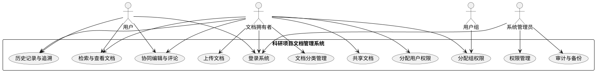
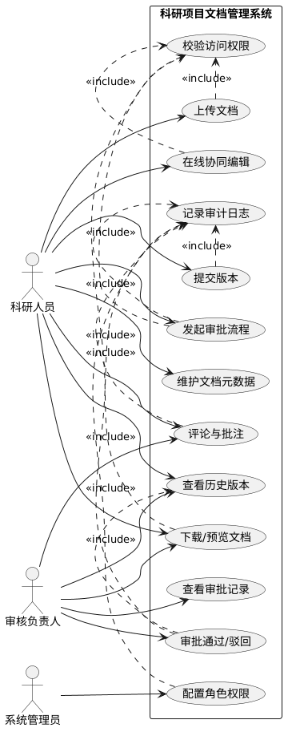

# 科研项目文档管理系统分析规格说明书

## 1. 文档说明

### 1.1 编写目的

本文档用于描述科研项目文档管理系统的需求分析结果，作为系统设计、前后端开发、测试验收与汇报展示的依据。

### 1.2 系统目标

科研项目文档管理系统面向科研机构、高校及研发团队，支持项目全生命周期中的文档统一存储、分类归档、权限控制、历史追溯、共享协作和实时编辑，提升科研资料管理的规范性与协作效率。

### 1.3 技术实现约束

- 前端框架：`React`
- 业务组件库：`Ant Design`
- 协同文档编辑：`Tiptap + Yjs`
- 后端服务：`Go`

上述技术约束会直接影响系统需求实现方式：

- `React + Ant Design` 负责管理后台、文档列表、共享设置、权限配置与检索交互。
- `Tiptap + Yjs` 负责富文本协同编辑、多人实时同步、冲突合并与在线讨论能力。
- `Go` 负责权限校验、文档元数据管理、历史记录保存、共享授权、组权限分配、检索接口与存储服务对接。

## 2. 系统角色定义

### 2.1 普通用户

系统中的参与者本质上都是用户。用户在被授权后可以查看、编辑、评论、下载和参与协同编辑。

### 2.2 文档拥有者

文档创建者或被指定的拥有者负责管理该文档的共享策略，可向其他用户或用户组分配 `可编辑`、`只读`、`不可见` 等权限。

### 2.3 系统管理员

负责用户与用户组管理、权限策略配置、审计追踪、数据备份恢复等系统级操作。

### 2.4 用户组

用户组用于批量授权，例如课题组、实验室、项目团队等。文档拥有者可直接向组分配统一权限，降低逐人维护成本。

## 3. 功能需求

### 3.1 文档集中存储与分类管理

系统应支持对科研项目相关文档进行统一存储，并按照项目名称、研究阶段、文档类型、负责人、所属课题等维度进行分类管理。

具体要求如下：

- 支持上传多种类型文档，如 `Word`、`PDF`、`Excel`、图片、音频、实验数据文件等。
- 支持为文档配置标签、所属项目、阶段、负责人、摘要等元数据。
- 支持按分类目录、标签和项目视图进行浏览。
- 支持文档归档与取消归档。

### 3.2 文档历史记录与追溯

系统应支持对文档修改过程进行历史留痕与快照追溯，保证科研材料在长期迭代过程中的完整性与可追溯性。

具体要求如下：

- 系统基于 `Yjs` 的协同更新能力自动保留编辑历史，不要求用户手动维护版本号。
- 每次正式保存、上传新文件或协同编辑提交后应生成历史记录。
- 支持查看编辑历史列表、操作时间、操作人和变更说明。
- 支持查看当前内容与历史快照之间的差异。
- 支持恢复到指定历史快照，并保留恢复行为记录。

### 3.3 权限管理与访问控制

系统应支持以“文档拥有者 + 用户/用户组授权”为核心的访问控制机制，避免敏感科研资料被未授权用户查看或修改。

具体要求如下：

- 支持文档拥有者向单个用户分配 `可编辑`、`只读`、`不可见` 等权限。
- 支持文档拥有者向用户组分配统一权限，实现组级共享。
- 支持按项目、课题组、文档分类或单个文档进行细粒度授权。
- 支持继承权限与单文档覆盖权限并存。
- 所有敏感操作前必须经过后端权限校验。

### 3.4 文档检索与快速定位

系统应支持高效的文档查找与内容定位能力，满足科研场景下海量资料快速调用需求。

具体要求如下：

- 支持基于标题、标签、负责人、项目编号、更新时间等字段检索。
- 支持关键词全文搜索。
- 支持按时间、类别、项目、权限状态等条件筛选。
- 支持从搜索结果直接跳转到文档详情、历史记录或共享设置。

### 3.5 协同编辑与在线讨论

系统应支持多人同时在线编辑文档，并围绕文档内容进行讨论与批注。

具体要求如下：

- 支持多人同时编辑同一份文档。
- 支持基于 `Yjs` 的实时状态同步与冲突合并。
- 支持基于 `Yjs` 的历史状态留痕与快照恢复能力。
- 支持使用 `Tiptap` 提供富文本编辑能力，如标题、表格、列表、图片、引用等。
- 支持针对文档片段添加评论、回复和处理状态。
- 支持展示当前在线协作者与编辑状态。

### 3.6 文档共享与协作流程管理

系统应支持围绕文档拥有者进行共享与协作管理，使文档在团队内部流转时具备明确的访问边界和责任归属。

具体要求如下：

- 支持从文档详情页配置共享对象和访问权限。
- 支持文档拥有者将文档共享给指定用户或用户组。
- 支持共享后立即生效，并在前端界面中展示当前权限状态。
- 支持文档拥有者随时收回权限、调整权限级别或转移拥有者。
- 支持共享变更与文档历史记录、评论记录一起保留追踪信息。

### 3.7 多格式预览与下载

系统应支持对常见科研文档进行统一查看与下载管理。

具体要求如下：

- 支持常用格式在线预览。
- 支持根据权限控制下载与导出行为。
- 对不支持在线预览的格式，至少应支持下载和元数据展示。

### 3.8 审计日志与操作追踪

系统应支持记录关键业务操作，满足科研项目合规与责任追踪要求。

具体要求如下：

- 记录上传、修改、删除、下载、授权、回滚、共享变更等关键动作。
- 支持按操作人、文档、时间范围进行日志查询。
- 审计记录不可被普通用户篡改。

### 3.9 数据备份与恢复

系统应支持文档与业务数据的备份恢复机制，保证重要科研资料安全。

具体要求如下：

- 支持定期备份文档文件与元数据。
- 支持异常情况下的数据恢复。
- 支持管理员查看备份状态与恢复结果。

## 4. 非功能需求

### 4.1 安全性

- 系统必须支持身份认证与会话管理。
- 所有业务接口必须在 `Go` 后端完成权限校验，不能仅依赖前端限制。
- 文档下载、授权变更、拥有者变更等敏感操作应写入审计日志。
- 协同编辑链路应保证连接身份可信，避免未授权用户加入协同会话。

### 4.2 性能要求

- 文档列表、检索结果与共享列表应具备较快响应能力。
- 多人协同编辑场景下，系统应保证实时同步延迟可接受。
- 面向较大规模文档库时，检索能力应保持可扩展。

### 4.3 可靠性

- 文档历史记录、权限状态、评论记录等关键数据必须可靠保存。
- 协同编辑中出现网络波动时，系统应尽量保证数据最终一致。
- 上传失败、共享失败等异常操作应有明确反馈与重试机制。

### 4.4 可用性

- 前端界面应保持统一、清晰，便于科研人员快速上手。
- 复杂业务操作如共享、回滚、授权应有明确提示与状态反馈。
- 使用 `Ant Design` 组件规范化表单、表格、弹窗、消息提醒，提高交互一致性。

### 4.5 可维护性

- 前端应按页面、业务模块、协同编辑能力拆分组件。
- 后端 `Go` 服务应按用户、文档、权限、共享、协同、日志等领域进行模块化设计。
- 接口应具备清晰的输入输出规范，便于前后端联调和后期维护。

### 4.6 可扩展性

- 支持后续增加新的文档类型、共享模板和角色策略。
- 支持未来接入对象存储、消息通知、全文检索服务等扩展能力。
- 协同编辑能力应支持后续扩展到更多文档场景。

### 4.7 兼容性

- 系统应兼容主流现代浏览器。
- 文档上传、预览和下载应兼容常见科研文档格式。
- 前端应适配常见桌面端分辨率。

### 4.8 可审计性

- 所有关键链路均应可还原操作过程。
- 历史记录、授权、共享与下载行为应可追踪到具体用户与时间。

## 5. 简单用例图

该用例图用于展示系统的整体参与者与核心业务能力。

## 6. 复杂用例图

该图聚焦于“协同编辑 + 历史记录 + 共享授权 + 权限控制”之间的细化关系。

## 7. 基于用例图的系统执行流程

### 7.1 主流程一：文档上传、分类与历史记录建立

1. 文档拥有者登录系统后进入项目空间。
2. 用户上传文档，前端 `React` 页面调用后端 `Go` 接口提交文件和元数据。
3. 后端完成权限校验、文件存储和元数据保存。
4. 用户补充项目、阶段、负责人、标签等分类信息。
5. 系统创建初始历史记录，并将文档状态设置为草稿或共享前状态。
6. 文档写入后，系统记录上传人、上传时间和初始历史信息。

该流程中的交互关系如下：

- `上传文档` 依赖 `权限校验`，否则不能写入文件。
- `文档分类管理` 与 `检索功能` 共享元数据。
- `历史记录` 与 `上传文档` 紧密绑定，任何正式提交都应形成可追溯的历史快照。

### 7.2 主流程二：协同编辑与讨论

1. 用户打开文档详情页，进入在线编辑界面。
2. 前端通过 `Tiptap` 渲染文档内容，通过 `Yjs` 建立实时协同会话。
3. 多名用户对文档进行实时编辑，`Yjs` 负责同步变更和冲突合并。
4. 系统在协同过程中自动保留历史留痕，不要求用户手动创建版本号。
5. 用户可针对段落或片段添加评论、回复或处理标记。
6. 当用户执行正式保存时，系统将当前协同结果固化为新的历史快照。

该流程中的交互关系如下：

- `协同编辑` 与 `历史记录` 之间是先实时同步、后正式留痕的关系。
- `Yjs` 提供底层协同和历史快照能力，系统在业务层只暴露“历史记录/恢复”而不暴露“版本号管理”。
- `评论与讨论` 为团队协作提供上下文依据。
- `权限控制` 不仅决定是否能进入文档，也决定是否具备编辑或评论权限。

### 7.3 主流程三：文档共享与权限分配

1. 文档拥有者在文档详情页打开共享设置。
2. 前端展示用户、用户组和当前权限列表。
3. 拥有者为指定用户或用户组分配 `可编辑`、`只读` 或 `不可见` 权限。
4. 前端提交共享配置，后端完成拥有者身份校验和权限写入。
5. 系统即时更新访问策略，并记录共享变更日志。
6. 被授权用户随后即可查看、编辑或评论文档；未授权用户在检索和访问时将被过滤或拦截。

该流程中的交互关系如下：

- `共享功能` 建立在 `文档拥有者` 身份之上，普通用户不能越权分配他人文档权限。
- `用户权限` 与 `组权限` 会共同作用于访问结果，后端需要统一计算最终权限。
- `审计日志` 记录共享全过程，支持责任追踪与合规检查。

### 7.4 主流程四：检索、查看与下载

1. 用户进入文档列表页或项目空间。
2. 前端通过 `Ant Design` 的表格、筛选器和搜索组件展示检索条件。
3. 用户输入关键词或筛选条件后，前端调用后端检索接口获取结果。
4. 后端根据用户权限过滤数据，仅返回可访问文档。
5. 用户可查看文档详情、查看历史记录、预览内容或下载文件。

该流程中的交互关系如下：

- `分类管理` 为检索提供结构化筛选条件。
- `权限控制` 为检索结果进行过滤。
- `历史记录` 使查看历史编辑轨迹和恢复快照成为可能。
- `下载行为` 同样应纳入审计日志。

## 8. 各功能之间的交互分析

### 8.1 功能交互总览

系统核心功能之间不是孤立存在，而是围绕“文档”这一中心对象形成联动关系，整体交互链路如下：

- `文档上传/创建` 会触发 `元数据登记`，并写入初始 `历史记录`。
- `分类管理` 为 `检索功能` 提供结构化筛选条件。
- `共享授权` 决定用户是否能够执行 `查看`、`评论`、`编辑`、`下载` 等动作。
- `协同编辑` 产生的内容变化会沉淀到 `历史记录` 中。
- `评论讨论` 依附于文档内容和访问权限存在。
- `下载/预览` 与 `查看权限` 直接关联，并应写入 `审计日志`。
- `共享变更`、`恢复历史快照`、`权限调整` 等关键操作都需要被 `审计日志` 记录。

从系统运行角度看，功能之间的调用顺序通常表现为：

`文档创建/上传 -> 分类与元数据 -> 权限分配 -> 协同编辑/评论 -> 历史留痕 -> 检索查看/下载 -> 审计追踪`

### 8.2 文档管理与权限管理的交互

文档管理的上传、查看、编辑、下载、共享等动作均受到权限模块控制。前端仅负责展示可操作入口，真正的访问控制由 `Go` 后端统一校验。也就是说，文档管理负责“对象本身”，权限管理负责“谁可以对对象做什么”。

具体交互表现如下：

- 当用户打开文档时，系统先判断其是否具备 `可见` 权限。
- 当用户进入协同编辑时，系统进一步判断其是否具备 `可编辑` 权限。
- 当用户尝试下载文档时，系统判断其是否具备下载或导出权限。
- 当文档拥有者调整共享范围时，权限管理结果会立即反映到文档访问结果中。

### 8.3 文档管理与历史记录的交互

文档生命周期中的每次正式变更都会生成历史记录。历史记录模块不仅服务于追溯，也为共享后的协作、恢复和审计提供依据。文档管理负责保存当前状态，历史记录负责保存“过去发生过什么”。

具体交互表现如下：

- 新建文档时生成初始历史记录。
- 上传新文件或保存编辑内容时追加新的历史快照。
- 恢复历史快照后，系统会将恢复动作本身继续写入历史记录。
- 用户查看文档详情时，可以从当前文档进入历史记录列表。

### 8.4 协同编辑与历史记录的交互

`Yjs` 负责实时同步、冲突合并和历史状态支撑，`Tiptap` 负责编辑体验；系统业务层不强调人工版本号，而是将保存后的状态沉淀为可追溯的历史快照。

具体交互表现如下：

- 协同编辑过程中，多用户对同一文档的修改先通过 `Yjs` 实时同步。
- 用户执行保存后，系统将当前状态固化为历史快照。
- 当用户需要回看修改过程时，系统从历史记录中恢复对应状态。
- 评论与批注通常依附于当前内容上下文，因此恢复历史快照时需要同步考虑评论定位关系。

### 8.5 共享流程与权限管理的交互

共享不是单纯的链接分发，而是以文档为中心进行权限分配。文档拥有者设置的用户权限、组权限和默认可见范围共同决定最终访问结果。

具体交互表现如下：

- 文档拥有者可直接给单个用户分配 `可编辑`、`只读`、`不可见` 权限。
- 文档拥有者可按用户组批量授权，减少重复配置。
- 当用户同时命中“个人权限”和“组权限”时，后端需要按既定优先级计算最终权限。
- 权限一旦变更，检索结果、查看权限、编辑权限和下载权限都会同步变化。

### 8.6 共享协作与评论讨论的交互

协同讨论中的批注和评论依赖访问权限生效。只有具备查看权限的用户才能看到评论，具备编辑权限的用户才能在协作上下文中持续参与内容修改。

具体交互表现如下：

- 用户具备 `只读` 权限时，可查看文档及其相关评论，但不能修改正文。
- 用户具备 `可编辑` 权限时，可修改正文并继续参与评论讨论。
- 文档拥有者收回权限后，用户对文档和评论的访问能力也会同步失效。
- 评论内容可作为后续查看历史记录和理解修改背景的重要补充信息。

### 8.7 检索功能与分类管理的交互

分类标签、文档类型、所属项目、负责人等元数据是检索的重要基础。分类质量越高，检索结果越准确。

具体交互表现如下：

- 用户上传文档后填写的分类信息会进入检索索引。
- 用户在列表页按项目、标签、更新时间等条件筛选时，系统实际依赖的就是分类元数据。
- 当文档分类被修改时，检索结果和筛选命中情况会随之更新。
- 历史记录、共享状态等信息也可以作为高级筛选条件参与检索。

### 8.8 审计日志与全功能链路的交互

审计日志横向贯穿上传、编辑、共享、下载、授权与恢复等全部关键操作，是系统可追溯性的重要保障。

具体交互表现如下：

- 上传文档时记录上传人、时间和对象信息。
- 调整共享权限时记录操作者、变更前后权限和变更时间。
- 下载或导出文档时记录访问行为，便于后续审计。
- 恢复历史快照时记录恢复来源和执行人，避免历史操作不可追踪。

